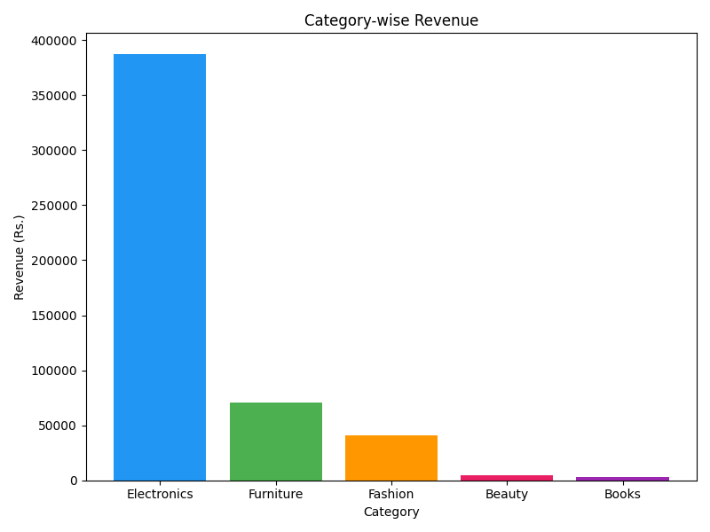
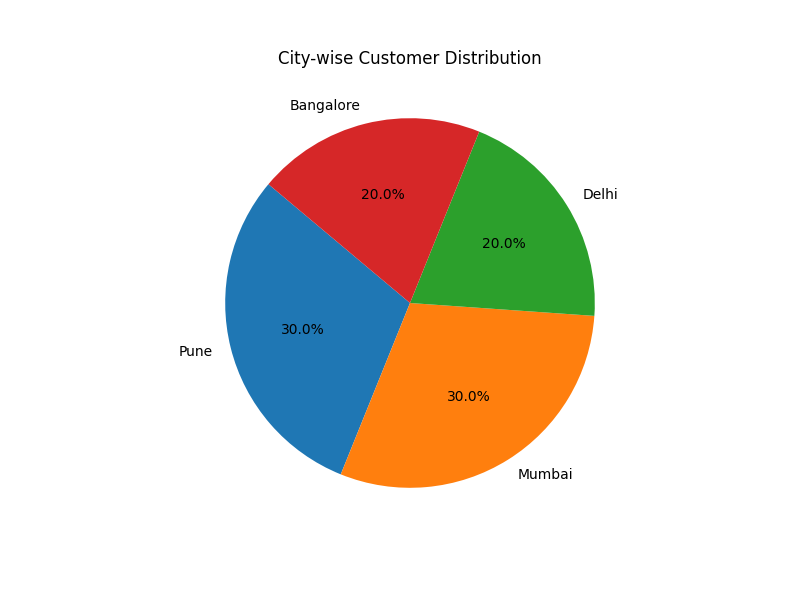

## 🛒 AI Shopping Behavior Analyzer

### 💡 About
How does Amazon know what you want to buy next?
How does Flipkart show you the perfect product?

I was curious about this — so I built it myself.

This AI-powered platform analyzes real customer shopping 
behavior, identifies high-value customers, predicts buying 
patterns, and generates complete business insights — 
exactly like real e-commerce companies do!

### 🛠️ Technologies Used
- Python 3.12
- Pandas — Data Processing & Analysis
- SQLite — Database Storage & SQL Queries
- Scikit-learn — Random Forest AI Model
- Matplotlib — Business Charts & Visualization
- Seaborn — Advanced Data Visualization

### 📁 Dataset Used
| File | Contains |
|------|----------|
| customers.csv | 10 customers — age, city, gender |
| products.csv | 15 products — category, price |
| transactions.csv | 25 transactions — orders, ratings, dates |

### ⚙️ How it Works
1. 📂 Loaded raw data from 3 CSV files
2. 🗄️ Stored data in SQLite database
3. 🔍 Analyzed revenue & patterns using SQL queries
4. 🤖 Random Forest AI predicted high-value customers
5. 📊 Visualized business insights using charts

### 📊 Business Insights Generated
| Metric | Result |
|--------|--------|
| 💰 Total Revenue | Rs. 5,06,564 |
| 🏆 Top Category | Electronics — Rs. 3,86,993 |
| 👑 Top Customer | Rahul Sharma — Rs. 1,28,997 |
| 🤖 AI Accuracy | 80% |
| 🏙️ Top City | Pune & Mumbai |

### 🤖 AI Model Performance
- Algorithm: Random Forest Classifier
- Accuracy: 80%
- Task: Predicting High-Value Customers

### 📤 Sample Output

=== AI E-COMMERCE CUSTOMER ANALYTICS PLATFORM ===

💰 Total Revenue: Rs. 5,06,564

📊 Category-wise Revenue:
Electronics: 7 orders | Rs. 3,86,993
Furniture: 3 orders | Rs. 70,997
Fashion: 7 orders | Rs. 40,489

👑 Top Customer: Rahul Sharma | Rs. 1,28,997
🤖 AI Model Accuracy: 80.0%
👑 High Value Customers Identified!
🎉 Analysis Complete!

### 📈 Visual Insights

### 🚀 How to Run

py -m pip install pandas scikit-learn matplotlib seaborn

py main.py

